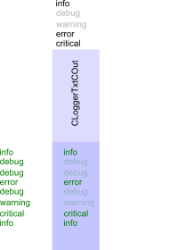
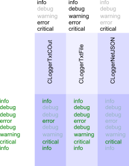
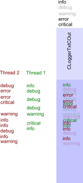
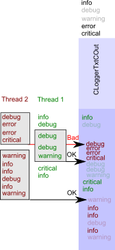
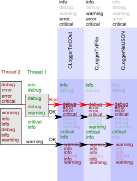

# Logger Library
This is flexible C++ library to output log information with different log levels, different log channels and different
log messages grouping.

## Contents
- [Features](#features)
  - [Log levels](#log-levels)
  - [Targets](#targets)
  - [Thread safe mode](#thread-safe-mode)
  - [Task](#task)
  - [Full conception](#full-conception)
- [Requirements](#requirements)
- [Installation](#installation)
- [Roadmap](#roadmap)
- [History](#history)
  
## Features

There are several implemented features : log levels, targets, thread safety, tasks.

### Log levels


During development you need a lot of detailed information. Say, while implementing changing some information in database
you need to test access to DB, SELECT query and INSERT one. During development you need detailed information about each
step, all errors codes, query requests and response etc. When this step is fully implemented and tested you do not need
such detailed information. You could remove all this excessive output, but is is better to leave it for future. It will
be used in future if you change something in this development.

For this goal "logger level" is introduced. You can enable some of them or disable. There is an example of such levels :
- "INFO" : general information.
- "DEBUG" : detailed data for debugging only.
- "WARNING" : some warning about potential problem.
- "ERROR" : fail, but only local one. For example, you can't open some file, but application will continue to work.
- "CRITICAL" : application can not continue its work.

It is an example, you have to introduce your own.

On the picture debug and warning messages are disabled. So, they are not sent to output target "CLoggerTxtCOut". But you can
enable them in future, so they are prepared, but not output.

### Targets


There are different output targets. For now console and file output are implemented, but it is easy to implement another ones.

During application work sometimes you need to output the same message to different outputs simultaneously. Say, you can output
some important information to the console, detailed information to file and crashes (critical messages) by network.

For this goal target entity is introduced. It is implemented by CLoggerGroup class and its children classes :

```cpp
Logger::CLoggerTxtGroup<
        Logger::CLoggerTxtCOut<Logger::CLoggerThrSafe, wchar_t>,
        Logger::CLoggerTxtFile<Logger::CLoggerThrSafe, wchar_t>
> _log;
```

In this example `_log` group variable is instantiated. It consists of two logger target - console one and file.

You can select different log levels for each target individually. When you send some message to `_log` it will be prepared
once and it will be sent for each target.

### Thread safe mode


In single thread application one message can be sent to output in the same time. But in multithreading application simultaneous
output can create a mess. This is why blocking techniques must be used in this case.

In single thread application, however, this overhead is not necessary. This is why CLoggerBase class and its children have
boolean thread safe flag as the first template parameter. Set it to false in single thread application and enable it in
other cases.

### Task


Multithreading mode has not only mess problem, but a mixture of different logical processes too. Say, you have one thread
that works with database, and another one communicating with some hardware device. They have different logical steps
output in the same time. It will be difficult to analyze some troubles in messages mixture.

Task entity can help you in this situation. "Task" in this logger is the single logical operation without output until its finish.
Task operation can be successful or failed. In case of success you don't need any information, but in case of error you
need to have the most detailed output.

Task collects all messages, but do not outputs them until the finish. Before task destruction you need to set "success" or
"fail" status. If the goal was successful, only enabled log levels messages will be output. In the case of fail all messages
will be output regardless current log levels mode.

You can set some specific log levels for each task if needed.

In both cases all messages will be output at the task finish.

### Full conception


All those entities can be used simultaneously.

For the logger that can be one single target or group ones you set up log levels to be enabled. If needed you can configure
individual options for each target.

You have to select single thread mode or multithread one for logger.

You can start target for some logically connected steps. You prepare all log messages that you need. Before the task finish
you have to select ist state, success or fail. In case of fail all messages will be output.

## Requirements
- **C++17** because of wide fold expression usage.
- **сmake** is used for library configuring. However, all targets except of test_logger are interfaces, so you can
directly include them with your preferred make system.

## Installation
Clone repository :

```bash
git clone https://github.com/OleksandrNemchenko/logger
```

Logger library contains interface library only except UUT target, so you can directly include headers and use them.

You can make and start test_logger target to test all features. Visit this target source files to see library usage.

## Roadmap
* version 1.1 :
    - create Doxygen documentation for all entities
    - create gh-pages description
* version 1.2+ :
    - add library detailed description
    - add library usage examples
    - make full test coverage
    - add additional asserts and checks
    - add std::experimental::source_location usage for current file name and line number usage
    - CLoggerTxtBase : deprecate SetDateOutputFormat, SetLevelPrefix, SetLevelPostfix, SetSpace functions and introduce
      functional object that will be called for log message decorating

## History
* [version 1.0](https://github.com/OleksandrNemchenko/logger/tree/release/v1.0) :
    - logger library with tasks and group entities.